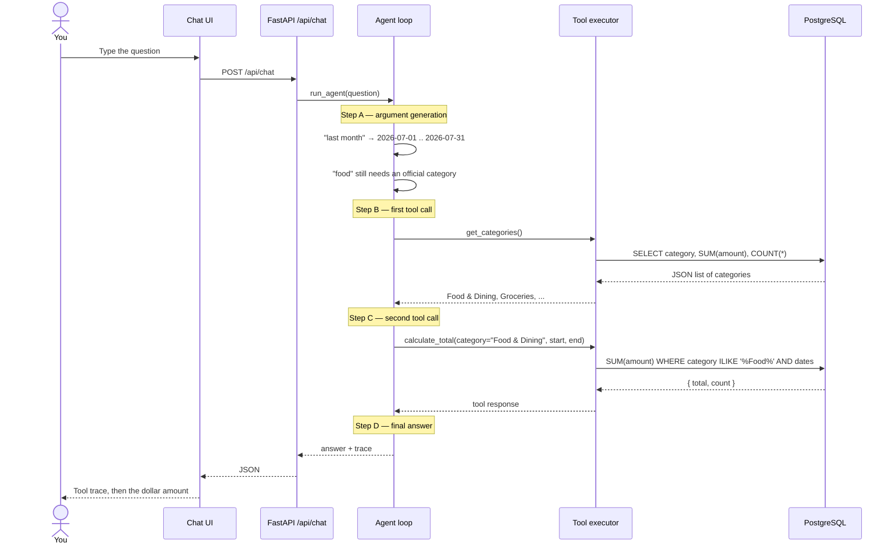
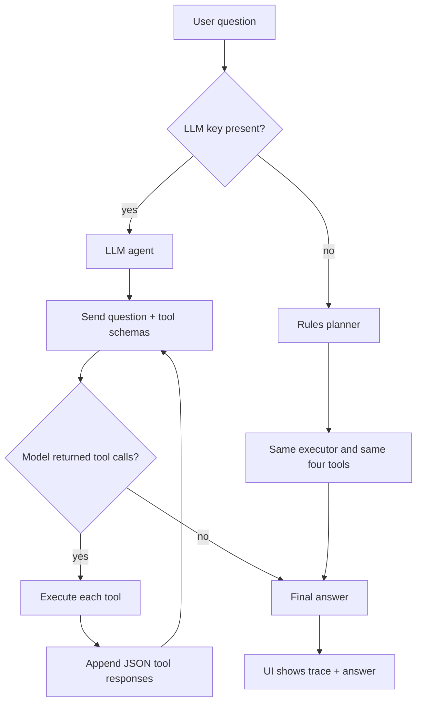

# Ledger — financial transaction agent

Ask questions like *"How much did I spend on food last month?"* and get answers
backed by real queries, not guessed numbers.

The agent can only touch the database through four tools:

| Tool | When it is used |
|---|---|
| `get_categories()` | Resolve names like "food" to `Food & Dining` |
| `filter_transactions()` | List matching purchases |
| `calculate_total()` | Answer "how much" questions |
| `get_transactions()` | Latest activity with no filters |

It runs as **FastAPI**. Locally it uses **SQLite** so you can start without Docker
or Postgres. Docker Compose + PostgreSQL can be added later.

---

## How a question moves through the system

This is the full path of:

> "How much did I spend on food last month?"



Nothing in that path is hidden. The UI prints every **tool call** and **tool
response** before the final sentence.

---

## The seven ideas this project is built on

These map 1:1 onto the files under `app/agent/`.

1. **Tool definitions** — `app/agent/tools.py`  
   Ordinary Python functions. They are the only way to read transactions.

2. **Tool schemas** — `app/agent/schemas.py`  
   JSON Schema contracts. The LLM never sees the Python source. It only sees
   names, descriptions, and argument types.

3. **Function calling** — `app/agent/loop.py`  
   The model is invoked with `tools=TOOL_SCHEMAS`. Instead of prose it can
   return `{ "name": "calculate_total", "arguments": { ... } }`.

4. **Argument generation** — same loop, plus `app/agent/dates.py`  
   "Last month" must become `start_date` / `end_date`. Casual "food" must
   become a real category. The LLM does this itself. Rules mode uses a
   small parser.

5. **Tool execution** — `app/agent/executor.py`  
   A registry maps the string `"calculate_total"` to the Python function and
   runs it against the open Postgres session.

6. **Tool responses** — JSON comes back into the conversation as a `tool`
   message. The next model turn can read those numbers.

7. **Multiple tool calls** — the loop repeats (capped at 8 steps). The food
   example needs two calls: categories, then the total.



---

## Two agent modes

| Mode | When | How arguments are generated |
|---|---|---|
| **Rules** | `OPENAI_API_KEY` is empty (default) | Regex + date helpers. No paid API. |
| **LLM** | `OPENAI_API_KEY` is set | OpenAI-compatible function calling |

Both modes call the **same four tools** and return the **same trace shape**.
Turn on an LLM later without changing the database or the API.

To use Groq, Ollama, or any OpenAI-compatible server, set `LLM_BASE_URL` in `.env`.

---

## Project layout

```text
app/
  main.py              FastAPI app, creates tables, seeds data
  api.py               POST /api/chat, GET /api/meta
  config.py            Env settings
  database.py          SQLAlchemy engine + session
  models.py            Transaction table
  seed.py              Synthetic ~6 months of purchases
  agent/
    schemas.py         JSON tool contracts
    tools.py           Python implementations
    executor.py        Name → function
    dates.py           "last month" → date range
    planner.py         Rules-mode argument generation
    prompts.py         LLM system prompt
    loop.py            Function-calling loop
  static/              Chat UI that renders the tool trace
```

---

## Run it

```bash
python -m venv .venv
.venv\Scripts\activate
pip install -r requirements.txt
uvicorn app.main:app --reload
```

Open [http://localhost:8000](http://localhost:8000).

On first boot the API:

1. Creates `ledger.db` (SQLite) and the `transactions` table.
2. Inserts deterministic fake purchases (same numbers every time, seed `42`).
3. Serves the chat UI.

Optional LLM: set `OPENAI_API_KEY` in `.env` and restart.

---

## API

`POST /api/chat`

```json
{ "question": "How much did I spend on food last month?" }
```

```json
{
  "answer": "You spent $1,234.56 on Food & Dining from 2026-07-01 to 2026-07-31 across 42 transactions.",
  "mode": "rules",
  "trace": [
    { "type": "tool_call", "name": "get_categories", "arguments": {} },
    { "type": "tool_result", "name": "get_categories", "result": { "categories": [] } },
    { "type": "tool_call", "name": "calculate_total", "arguments": {
        "category": "Food & Dining",
        "start_date": "2026-07-01",
        "end_date": "2026-07-31"
    }},
    { "type": "tool_result", "name": "calculate_total", "result": { "total": 1234.56, "count": 42 } }
  ]
}
```

`GET /api/meta` — row count, date range, categories, active mode.  
`GET /docs` — Swagger UI.

---

## Synthetic data

`app/seed.py` writes a few hundred rows spanning roughly six months. Categories
include Food & Dining, Groceries, Transport, Shopping, Entertainment,
Bills & Utilities, Healthcare, Travel, and Subscriptions. Amounts are random
but **deterministic**, so reruns produce the same ledger.
